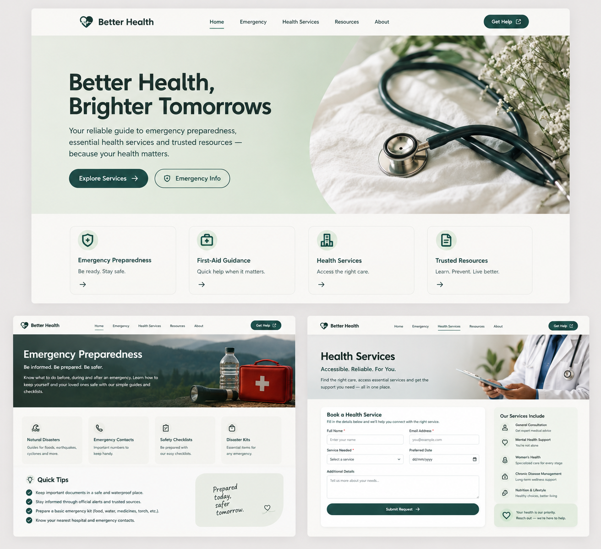

# Better Health

A responsive health-services web application focused on medical emergency awareness and preparedness.

## Preview



## Features

- Emergency preparedness information
- First-aid guidance
- Emergency contact shortcuts
- Health service request form
- Responsive React interface
- Node.js and Express backend structure
- MongoDB service-request model

## Tech Stack

- React
- JavaScript
- HTML
- CSS
- Node.js
- Express
- MongoDB
- Vite

## Project Structure

```text
better-health-website/
├── App.jsx
├── main.jsx
├── styles.css
├── index.html
├── package.json
├── vite.config.js
├── server.js
├── services.js
├── ServiceRequest.js
├── .env.example
└── README.md
